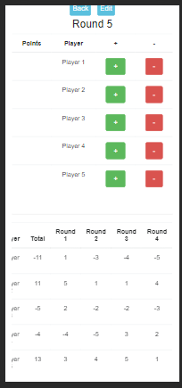

# CustomApp : Declic Family Point Calculator

This Angular application is designed to manage calculators for the "Declic Family" board game. It enables users to create, track, and manage game calculators for different scenarios, including features such as:

## Features

- Creating Calculators: Users can create new calculators by providing a name and specifying the number of players involved in the game.
- Managing Rounds: Allows for the management of game rounds, scoring, and player details dynamically.
- Player Interaction: Users can add, subtract, and validate scores for each player in different game rounds.

## Board Game Description

"Déclic Family" is a lively party/board game where one player reads out statements and the others must quickly decide if they're "true" or "false."

True or false? Do chickens have teeth? Easy to answer, right? But can you do it in less than a second? And without making a mistake? That's one of the 495 challenges in Déclic Family! It's a wild game of reflexes and atmosphere. Choose one hand for 'true' and the other for 'false' and swiftly place the correct hand on the central target to give your answer.

For instance, if there are 7 players, the first one to place their hand correctly in the center and answer correctly earns 7 points. If they answer incorrectly, they lose 7 points. The last person to respond gains 1 point if they answer correctly or loses 1 point if they answer incorrectly.

## Installation

To run the application, follow these steps after cloning the repository:

```sh
npm install -g bower
npm install
bower install
npm start
```

# Usage

## Features

- Calculator View: Displays a comprehensive view for managing calculators, rounds, and player scores.
- Round Management: Allows users to track and validate game rounds, add and subtract scores, and manage player interactions.

## Code Overview

The application's main functionalities are divided into Angular components:

- list-calculator: Manages the list of calculators.
- calculator: Handles the detailed management of individual calculators, including rounds and player scores.

## Starting the Application

After the server starts, access the application through your browser at http://localhost:3000/#/declic/list-calc.

- Click on "+":


- You can click on edit, to set player's name, or starting giving points


- By clicking "+", on this order "player 1, player 3, player 5", and "-" on player 4


- You can validate or reset the point of the round :


- When validating :


- We can see scores at the each round, and the total points of each players, and their rank.



